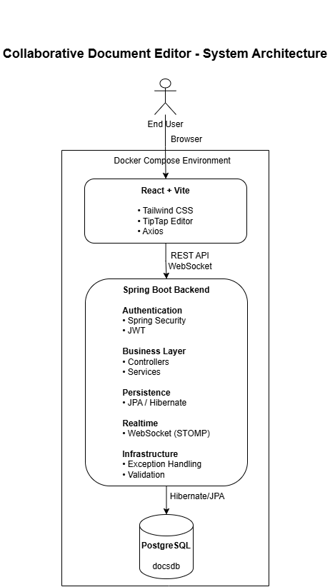

# 📄 Collaborative Document Editor


A production-inspired collaborative document editor built using **Spring Boot**, **React**, **PostgreSQL**, **WebSockets**, **JWT Authentication**, and **Docker**.

The application enables multiple users to securely create, edit, share, and collaborate on documents in real time while following modern backend engineering practices such as layered architecture, REST APIs, authentication, exception handling, containerization, and environment-based configuration.

---
## 📑 Table of Contents

- [Features](#-features)
- [System Architecture](#-system-architecture)
- [Tech Stack](#-tech-stack)
- [Project Structure](#-project-structure)
- [Getting Started](#-getting-started)
- [Environment Variables](#-environment-variables)
- [Future Enhancements](#-future-enhancements)
- [License](#-license)

## ✨ Features

### 🔐 Authentication & Security

- JWT Authentication
- Spring Security
- BCrypt Password Encryption
- Secure REST APIs
- Role-Based Authorization

### 📄 Document Management

- Create Documents
- Update Documents
- Delete Documents
- Search Documents
- Pagination
- Rich Text Editing

### 🤝 Collaboration

- Real-time document collaboration
- WebSocket communication
- Typing indicators
- Presence tracking
- Document sharing
- Collaborator permissions

### 💬 Productivity

- Comments
- Notifications
- Activity logs
- Version history

### ⚙️ Engineering Practices

- Layered Architecture
- DTO Pattern
- Global Exception Handling
- Validation
- Logging
- Environment-based Configuration
- Dockerized Application
- PostgreSQL Integration

---
## 🏗️ System Architecture



The Collaborative Document Editor follows a layered architecture where the React frontend communicates with the Spring Boot backend using REST APIs for standard operations and WebSockets (STOMP) for real-time collaboration. The backend is secured using Spring Security and JWT authentication, while Spring Data JPA/Hibernate manages persistence with PostgreSQL. Docker Compose orchestrates the application services, providing a consistent local development environment.
---
## 🛠 Tech Stack

| Layer | Technology |
|-------|------------|
| Backend | Spring Boot 3 |
| Language | Java 17 |
| Frontend | React + Vite |
| Database | PostgreSQL |
| Security | Spring Security + JWT |
| ORM | Spring Data JPA / Hibernate |
| Build Tool | Maven |
| Styling | Tailwind CSS |
| Realtime | WebSocket + STOMP |
| Containerization | Docker & Docker Compose |
| Version Control | Git & GitHub |

---

## 📂 Project Structure

```text
backend
├── config
├── controller
├── dto
├── exception
├── model
├── repository
├── security
├── service
├── websocket

frontend
├── components
├── pages
├── services
├── hooks
├── utils
└── assets
```

---

## 🚀 Getting Started

### Clone Repository

```bash
git clone https://github.com/<your-username>/collaborative-document-editor.git
cd collaborative-document-editor
```

### Start using Docker

```bash
docker compose up --build
```

Backend

```
http://localhost:8081
```

Frontend

```
http://localhost:3000
```

---

## 🔑 Environment Variables

The application uses environment variables for sensitive configuration.

| Variable | Description |
|----------|-------------|
| DB_USERNAME | PostgreSQL Username |
| DB_PASSWORD | PostgreSQL Password |
| JWT_SECRET | JWT Secret Key |

---

## 📈 Future Enhancements

- Redis Caching
- CI/CD with GitHub Actions
- AWS Deployment
- Elasticsearch
- Prometheus & Grafana Monitoring
- Kubernetes Deployment

---

## 📜 License

This project is developed for learning and portfolio purposes.